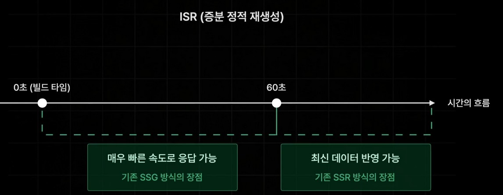

## 동적 경로 [id].tsx에 SSG 적용하기
```
export const getStaticPaths = () => {
  return {
    paths: [
      { params: { id: 1 } },
      { params: { id: 2 } },
      { params: { id: 3 } },
    ],
    fallback: false,
  };
};

export const getStaticProps = async (
  context: GetStaticPropsContext,
) => {
  const id = context.params!.id;
  const book = await fetchOneBook(Number(id));

  return {
    props: {
      book,
    },
  };
};
```

<br>

> `fallback 옵션 설정(paths 없는 경로로 요청시)`  
**false : 404 Not Found 반환**  
**"blocking" : 즉시 생성(Like SSR)**  
-> 빌드 타임에 사전에 생성해 두지 않았던 페이지까지 페이지까지 제공  
사전에 생성하지 않았던 페이지를 SSR 방식으로 새롭게 생성할 때 만약 추가적인 데이터를  
요청해야 된다거나 해서 페이지의 생성 시간 즉, 사전 렌더링을 하는 시간이 길어질 경우에는  
이 시간동안 넥스트서버가 브라우저에게 아무것도 응답하지 않기 때문에 어쩔 수 없이 로딩 발생  
이런 상황을 원치않는다면 true 로 설정  
**true : 즉시 생성 + 페이지만 미리 반환**  
-> UI만 먼저 렌더링하고 데이터는 나중에 전달
빠르게 Props 없는 페이지 반환하고 후속으로 Props가 있다면 Props를 계산하고
따로 Props만 반환. 즉, 데이터만 따로 보내 줌

<br>
<br>

### fallback 상태 체크하기
---
```
export default function Page({
  book,
}: InferGetStaticPropsType<typeof getStaticProps>) {
  
  // 로딩이 끝난 이후에 즉, fallback 상태가 끝난 이후에도 다른 문제가 발생해서
  // 이 데이터가 정말 없는 그런 상황에서는 대처가 안되기 때문에
  // 정말 fallback 상태에 있을 때에만 로딩중이라는 것을 렌더링해 주어야 한다.

  const router = useRouter();

  // fallback 상태일 경우..
  if (router.isFallback) {
    return '로딩 중입니다.';
  }

  // 로딩이 끝났는대도 문제가 발생할 경우...
  if (!book) {
    return {
      notFound: true,
    }
  }

  
  return (
    <div className={style.detail_container}>
      ...
    </div>
  );
}
```

<br>


